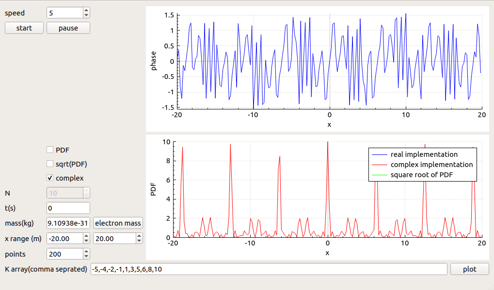
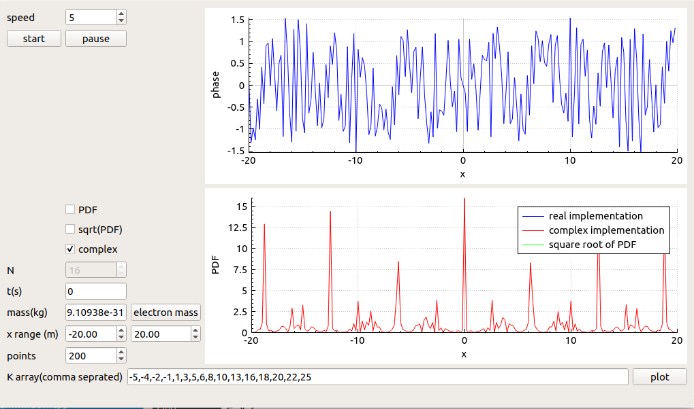
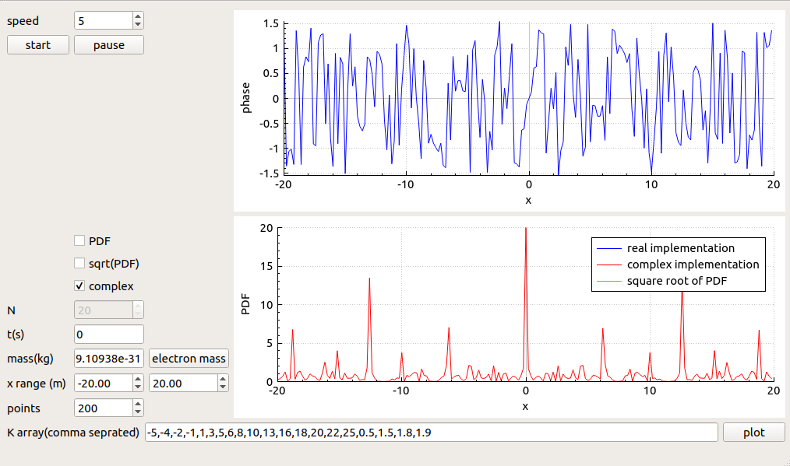
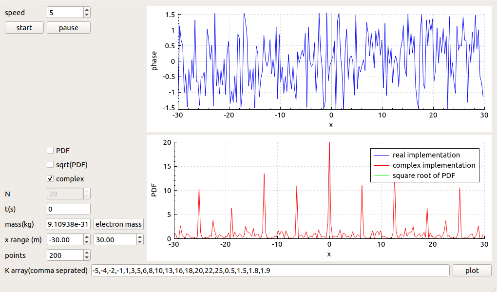
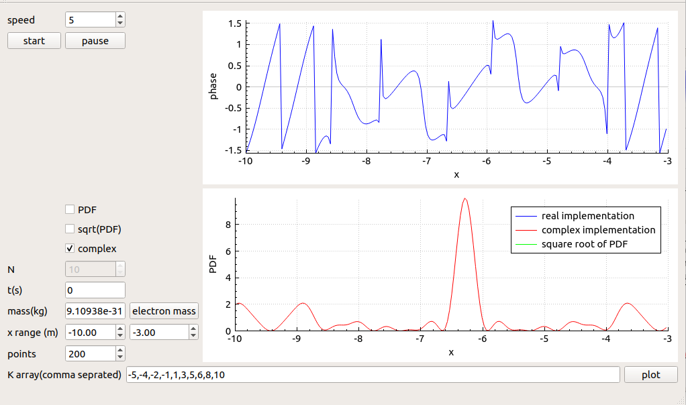

### Superposition Wave Function Visualization for free particle

This is a cross platform software that visualizes the **Amplitude**(the square root of **PDF**) and  **Phase** of a superposition wave function for a free particle in 1 dimension <code>x</code> 

This work is done as a bonus project for the Quantum Electronics Course of *[KN Toosi University of Technology](https://en.kntu.ac.ir), Tehran, Iran*, presented by [Dr. Ebrahim Nadimi](https://wp.kntu.ac.ir/nadimi/) (Special Thanks to Dr Nadimi for the excellent lectures that caused a solid understanding on Quantum Physics in me, and the guidance to do this projects)

#### General Description

The Schrodinger Equation is:

&space;=&space;\left[&space;-\frac{\hbar^2}{2m}\Delta&space;&plus;&space;V(x,t)&space;\right]&space;\Psi(x,t))

in a *1D* case, any linear composition of complex exponentials can be a solution to the SE:

while we can specify the correct relation between the **wave number** and the **angular frequency** (with the Energy associated with each state)

The **Born's rule** helps us to find the coefficients; considering that the complex exponentials are *orthonormal*, we can arbitrarily choose the coefficients so that:

we can choose the coefficients so that the state would be equally weighted:

#### Mathematical Calculations

The Amplitude

And there are `N` terms with `n=m` so:

The other `N(N-1)` terms are splittable in two groups in which each term in a group is corresponded to exactly one term in the other group, so that the corresponded terms are complex conjugate of each other (As we know for any `(n,m)` term, there is a `(m,n)` term):

And the **Born's rule** will be satisfied, while the integral of a `cosine` on a period is `0` 

The phase

#### Software Description

This numerical calculations are done using pure C++ and the STL (cmath)

The graphical application is wrote using Qt5 and to visualize and plot the results, QCustomPlot is used

#### inputs

​	**K array** comma separated

​	**x range** the calculation range

​	**number of points in x range**

​	**time variation speed**

​	**The particle mass** and a push button to set the default electron mass

​	**result type** you can choose which one to plot: sqrt(PDF), PDF, PDF with complex implementation (similar to real implementation)

#### Supsupplementary Description

To cover a possibility of wrong mathematical calculations for series and wrong programming algorithms, programming implementation with complex numbers has been done and the results was similar to the implementation with the series of `cosines`.  

#### some tests

As  you can see in the tests below, increasing number of harmonics, will increase the period value.

and from the last image (more resolution in x) we can see that the derivative of PDF is continuous 

